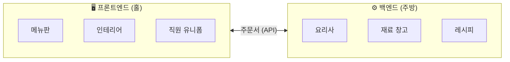
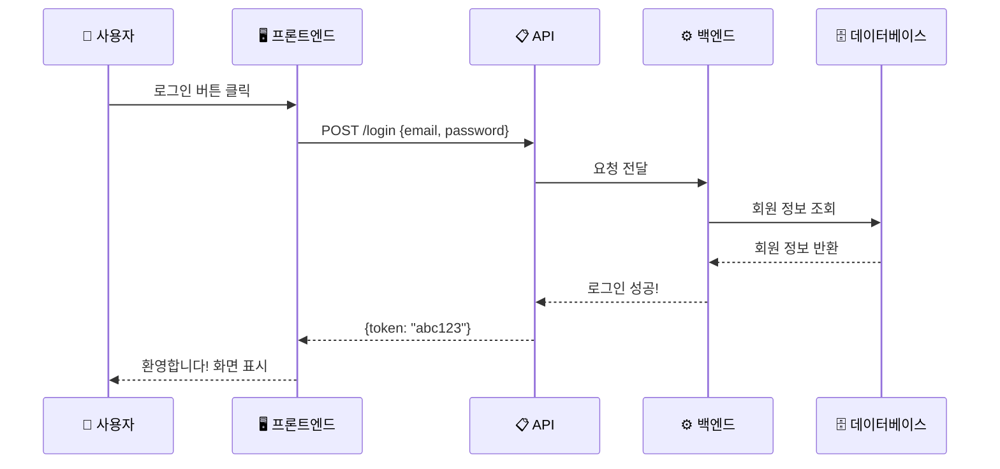
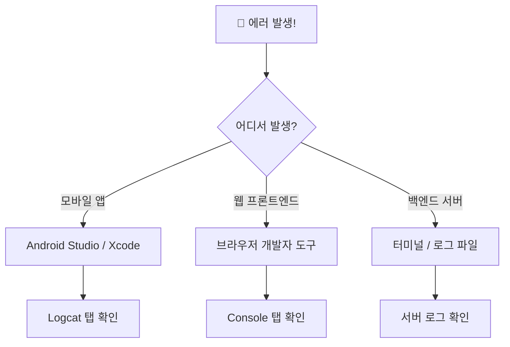
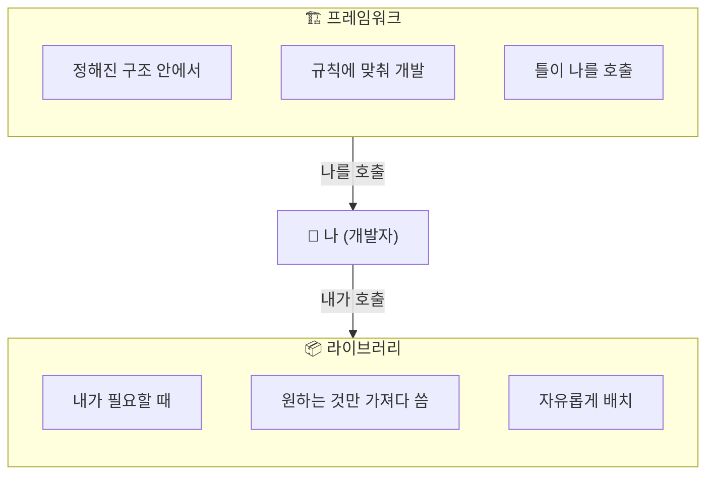
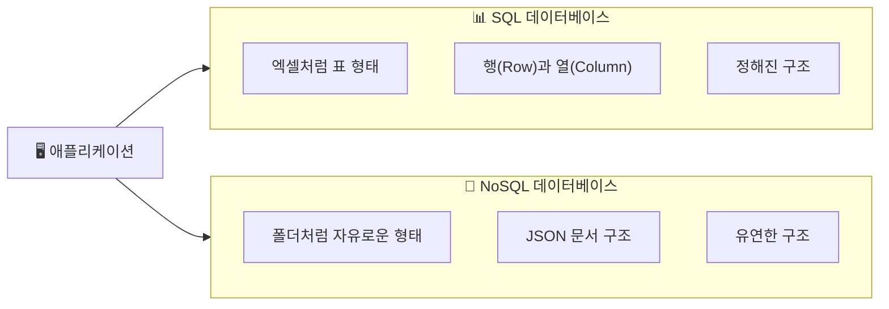
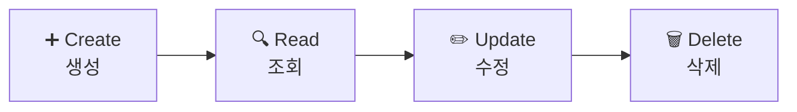
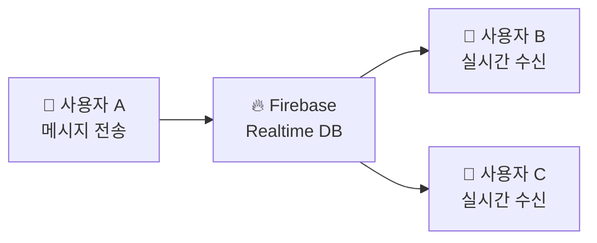
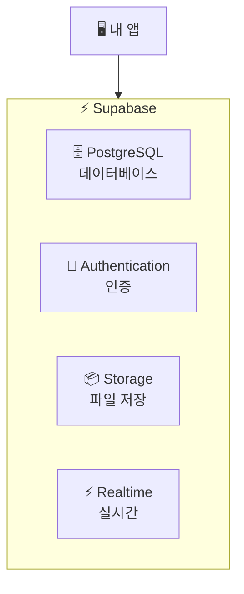
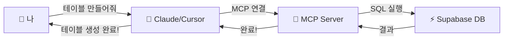

# 🚀 비개발자를 위한 바이브코딩 핵심 개념 가이드

> **바이브코딩(Vibe Coding)** 이란?  
> AI에게 "이런 거 만들어줘"라고 말하면 AI가 코드를 작성해주는 개발 방식입니다.  
> 하지만 **기본 개념을 알면 AI에게 더 정확한 지시**를 내릴 수 있습니다.

---

## 📚 목차

1. [프론트엔드 vs 백엔드](#1-프론트엔드-vs-백엔드)
2. [API](#2-api)
3. [에러 확인하기](#3-에러-확인하기)
4. [프레임워크 vs 라이브러리](#4-프레임워크-vs-라이브러리)
5. [데이터베이스(Database)](#5-데이터베이스database)

---

## 1. 프론트엔드 vs 백엔드

### 🍽️ 비유: 레스토랑

```
프론트엔드 = 홀 (손님이 보는 모든 것)
백엔드 = 주방 (손님에게 보이지 않는 곳)
```



### 프론트엔드 (Frontend)

**"사용자 눈에 보이는 모든 것"**

| 플랫폼 | 기술 | 설명 |
|--------|------|------|
| 웹 | Next.js, HTML/CSS | 브라우저에서 보는 웹사이트 |
| 모바일 | Android (Kotlin), iOS (Swift) | 스마트폰 앱 화면 |
| 데스크톱 | Electron | PC용 프로그램 화면 |

**프론트엔드가 하는 일:**
- 버튼, 입력창, 이미지 배치
- 버튼 누르면 색깔 바뀌는 애니메이션
- 사용자가 입력한 내용을 백엔드로 전달

### 백엔드 (Backend)

**"서버에서 몰래 처리하는 모든 것"**

| 기술 | 언어 | 주요 용도 |
|------|------|----------|
| FastAPI | Python | 빠른 API 서버 구축 |
| Node.js | JavaScript | 실시간 처리에 강함 |
| Firebase Functions | JavaScript | 서버 없이 백엔드 구현 |

**백엔드가 하는 일:**
- 로그인 확인 (이 사람이 진짜 회원인가?)
- 데이터 저장/조회 (게시글 불러오기)
- 결제 처리 (카드 정보 검증)
- 보안 처리 (해킹 방지)

### 💡 바이브코딩 팁

```
❌ "로그인 기능 만들어줘"

✅ "프론트엔드에 이메일/비밀번호 입력 폼 만들고,
    백엔드에서 Firebase Auth로 인증 처리해줘"
```

---

## 2. API

### 📱 비유: 식당 주문서

```
API = 홀과 주방이 소통하는 "주문서 양식"
```

손님이 "파스타 주세요"라고 말하면, 직원이 **정해진 양식의 주문서**에 적어서 주방에 전달합니다.  
주방은 주문서를 보고 요리를 만들어 다시 홀로 보냅니다.



### REST API 기본 개념

API는 **"요청 → 응답"** 구조입니다.

| HTTP 메서드 | 의미 | 예시 |
|------------|------|------|
| `GET` | 데이터 **조회** | 게시글 목록 불러오기 |
| `POST` | 데이터 **생성** | 새 게시글 작성 |
| `PUT` | 데이터 **수정** | 게시글 내용 변경 |
| `DELETE` | 데이터 **삭제** | 게시글 삭제 |

### 실제 API 예시

```
# 유저 목록 조회
GET https://api.example.com/users

# 새 유저 생성  
POST https://api.example.com/users
Body: { "name": "홍길동", "email": "hong@email.com" }

# 특정 유저 정보 수정
PUT https://api.example.com/users/123
Body: { "name": "김철수" }

# 유저 삭제
DELETE https://api.example.com/users/123
```

### Swagger UI - API 테스트 도구

백엔드 개발자가 만든 API를 **웹에서 직접 테스트**할 수 있는 도구입니다.

```
일반적인 Swagger 주소: http://localhost:8000/docs
```

Swagger UI에서 할 수 있는 것:
- 어떤 API가 있는지 목록으로 확인
- 각 API에 필요한 파라미터 확인
- 직접 값을 넣어서 테스트 실행
- 응답 결과 확인

### 💡 바이브코딩 팁

```
❌ "게시글 기능 만들어줘"

✅ "게시글 CRUD API 만들어줘.
    - GET /posts : 목록 조회
    - POST /posts : 새 글 작성  
    - PUT /posts/{id} : 글 수정
    - DELETE /posts/{id} : 글 삭제
    Swagger UI도 붙여줘"
```

---

## 3. 에러 확인하기

### 🔍 비유: 자동차 계기판 경고등

프로그램에 문제가 생기면 **에러 메시지**가 나타납니다.  
자동차 엔진 경고등처럼, 어디가 문제인지 알려주는 신호입니다.



### 플랫폼별 에러 확인 방법

#### 📱 Android (Android Studio)

1. Android Studio 하단의 **"Logcat"** 탭 클릭
2. 필터에 `error` 또는 앱 이름 입력
3. 빨간색 텍스트가 에러 메시지

```
# Logcat 에러 예시
E/MainActivity: NullPointerException: 변수가 비어있습니다!
```

#### 🍎 iOS (Xcode)

1. Xcode 하단의 **"Debug Area"** 확인
2. 또는 맥의 **"콘솔(Console)"** 앱 실행
3. 시뮬레이터/기기 선택 후 로그 확인

```
# Xcode 에러 예시  
Fatal error: Index out of range (배열 범위 초과!)
```

#### 🌐 웹 프론트엔드 (브라우저)

**Chrome / Edge에서 개발자 도구 여는 법:**

| 운영체제 | 단축키 |
|---------|--------|
| Windows | `F12` 또는 `Ctrl + Shift + I` |
| Mac | `Cmd + Option + I` |

**에러 확인 순서:**
1. 개발자 도구 열기
2. **"Console"** 탭 클릭
3. 빨간색 에러 메시지 확인

```
# Console 에러 예시
❌ Uncaught TypeError: Cannot read property 'name' of undefined
   → 해석: 'name'이라는 값을 읽으려 했는데, 데이터가 없음

❌ 404 (Not Found)  
   → 해석: 요청한 API 주소가 존재하지 않음

❌ 500 (Internal Server Error)
   → 해석: 서버(백엔드)에서 에러 발생
```

#### 🖥️ 백엔드 서버

터미널(명령 프롬프트)에서 서버 실행 중 에러가 표시됩니다.

```bash
# FastAPI 서버 에러 예시
INFO:     127.0.0.1:52431 - "GET /users HTTP/1.1" 500 Internal Server Error
ERROR:    database connection failed - 데이터베이스 연결 실패
```

### 자주 만나는 에러 코드

| 코드 | 의미 | 원인 |
|------|------|------|
| `400` | Bad Request | 잘못된 요청 (필수 값 누락) |
| `401` | Unauthorized | 로그인 필요 |
| `403` | Forbidden | 권한 없음 |
| `404` | Not Found | 주소가 틀림 |
| `500` | Server Error | 서버 내부 에러 |

### 💡 바이브코딩 팁

```
❌ "에러 나는데 왜 그래?"

✅ "콘솔에 이런 에러가 나와:
    'TypeError: Cannot read property 'data' of undefined'
    
    API 호출하는 부분인 것 같은데,
    응답 데이터가 없을 때 처리가 안 된 것 같아. 고쳐줘"
```

**에러 메시지를 복사해서 AI에게 보여주면 훨씬 정확한 해결책을 받을 수 있습니다!**

---

## 4. 프레임워크 vs 라이브러리

### 🏠 비유: 집 짓기

```
라이브러리 = 가구, 가전제품 (내가 필요한 것만 골라서 배치)
프레임워크 = 아파트 구조 (정해진 틀 안에서 인테리어)
```



### 라이브러리 (Library)

**"필요한 도구를 가져다 쓴다"**

내가 주도권을 가지고, 필요할 때 라이브러리의 기능을 **호출**합니다.

| 라이브러리 | 용도 | 사용 예 |
|-----------|------|--------|
| `requests` (Python) | HTTP 통신 | API 호출할 때 |
| `bcrypt` | 암호화 | 비밀번호 암호화할 때 |
| `moment.js` | 날짜 처리 | 날짜 포맷 바꿀 때 |
| `Lodash` | 유틸리티 | 배열/객체 다룰 때 |

```python
# 라이브러리 사용 예시 - 내가 필요할 때 호출
import requests  # HTTP 라이브러리

response = requests.get("https://api.example.com/data")  # 내가 호출!
print(response.json())
```

### 프레임워크 (Framework)

**"정해진 틀 안에서 개발한다"**

프레임워크가 프로그램의 흐름을 제어하고, 나는 **빈칸을 채워넣습니다.**

| 프레임워크 | 분야 | 특징 |
|-----------|------|------|
| **Unity** | 게임 개발 | 게임 루프, 물리엔진 제공 |
| **Next.js** | 웹 프론트엔드 | 라우팅, SSR 자동 처리 |
| **FastAPI** | 웹 백엔드 | API 구조, 문서화 자동 |
| **Flutter** | 모바일 앱 | UI 구조, 상태관리 제공 |

```python
# 프레임워크 사용 예시 - 프레임워크가 나를 호출
from fastapi import FastAPI

app = FastAPI()

@app.get("/hello")  # FastAPI가 정한 규칙대로 작성
def say_hello():    # 사용자가 /hello 접속하면 FastAPI가 이 함수를 호출!
    return {"message": "안녕하세요"}
```

### 핵심 차이점

| 구분 | 라이브러리 | 프레임워크 |
|------|-----------|-----------|
| 주도권 | **내가** 라이브러리를 호출 | **프레임워크가** 나를 호출 |
| 자유도 | 높음 (원하는 것만 사용) | 낮음 (규칙을 따라야 함) |
| 학습 곡선 | 낮음 | 높음 |
| 예시 | requests, Lodash | Next.js, Unity, FastAPI |

### 💡 바이브코딩 팁

```
❌ "파이썬으로 서버 만들어줘"

✅ "FastAPI 프레임워크로 REST API 서버 만들어줘.
    HTTP 요청은 requests 라이브러리 쓰고,
    비밀번호 암호화는 bcrypt 라이브러리 써줘"
```

---

## 5. 데이터베이스 (Database)

### 🗄️ 비유: 엑셀 vs 서류철

```
데이터베이스 = 체계적으로 정리된 데이터 저장소
```



### CRUD - 데이터의 4가지 기본 작업

모든 데이터 작업은 이 4가지로 귀결됩니다.

| 약자 | 영어 | 의미 | SQL 명령어 |
|------|------|------|-----------|
| **C** | Create | 생성 | `INSERT` |
| **R** | Read | 조회 | `SELECT` |
| **U** | Update | 수정 | `UPDATE` |
| **D** | Delete | 삭제 | `DELETE` |



### SQL vs NoSQL 데이터베이스

#### SQL 데이터베이스 (관계형)

**엑셀 표처럼 정해진 구조**가 있습니다.

```
┌──────┬──────────┬─────────────────┬─────┐
│ id   │ name     │ email           │ age │
├──────┼──────────┼─────────────────┼─────┤
│ 1    │ 홍길동   │ hong@email.com  │ 25  │
│ 2    │ 김철수   │ kim@email.com   │ 30  │
│ 3    │ 이영희   │ lee@email.com   │ 28  │
└──────┴──────────┴─────────────────┴─────┘
```

대표 서비스: **Supabase**, PostgreSQL, MySQL

#### NoSQL 데이터베이스 (비관계형)

**JSON 문서 형태**로 자유롭게 저장합니다.

```json
{
  "users": {
    "user_001": {
      "name": "홍길동",
      "email": "hong@email.com",
      "age": 25,
      "hobbies": ["독서", "영화"]  // SQL에선 별도 테이블 필요
    },
    "user_002": {
      "name": "김철수",
      "email": "kim@email.com"
      // age가 없어도 OK (유연한 구조)
    }
  }
}
```

대표 서비스: **Firebase Realtime Database**, MongoDB

### JSON 이해하기

JSON은 데이터를 표현하는 **텍스트 형식**입니다.

```json
{
  "이름": "값",
  "숫자": 123,
  "참거짓": true,
  "배열": ["항목1", "항목2"],
  "객체": {
    "내부키": "내부값"
  }
}
```

**실제 예시 - 유저 정보:**
```json
{
  "id": "user_001",
  "profile": {
    "name": "홍길동",
    "email": "hong@email.com"
  },
  "settings": {
    "theme": "dark",
    "notifications": true
  },
  "posts": ["post_001", "post_002"]
}
```

---

### 🔥 Firebase Realtime Database

Google이 만든 **실시간 NoSQL 데이터베이스**입니다.

**특징:**
- 데이터가 바뀌면 **실시간으로** 앱에 반영
- JSON 구조로 데이터 저장
- 채팅, 실시간 알림에 적합



**Firebase 데이터 구조 예시:**
```json
{
  "chatrooms": {
    "room_001": {
      "name": "개발자 모임",
      "messages": {
        "msg_001": {
          "sender": "홍길동",
          "text": "안녕하세요!",
          "timestamp": 1699999999
        }
      }
    }
  }
}
```

**활용 사례:** 실시간 채팅, 협업 문서, 실시간 대시보드

---

### ⚡ Supabase

**"오픈소스 Firebase 대안"** - PostgreSQL 기반 SQL 데이터베이스

**특징:**
- SQL 문법 사용 가능
- 실시간 기능 지원
- 인증, 스토리지 통합 제공
- **MCP 연동으로 AI 바이브코딩에 최적**



**Supabase 테이블 예시:**
```sql
-- 유저 테이블 생성
CREATE TABLE users (
  id UUID PRIMARY KEY,
  name TEXT NOT NULL,
  email TEXT UNIQUE,
  created_at TIMESTAMP DEFAULT NOW()
);

-- 데이터 조회
SELECT * FROM users WHERE name = '홍길동';

-- 데이터 추가
INSERT INTO users (name, email) VALUES ('홍길동', 'hong@email.com');
```

---

### 🤖 Supabase MCP로 바이브코딩하기

**MCP (Model Context Protocol)** 를 사용하면 AI가 직접 데이터베이스를 조작할 수 있습니다.

#### MCP란?

```
MCP = AI와 외부 도구를 연결하는 다리
```



#### Cursor에서 Supabase MCP 설정하기

**1단계: Supabase 프로젝트 정보 확인**

Supabase 대시보드 → Project Settings → API에서:
- `Project URL` 복사
- `service_role key` 복사 (비밀 키 주의!)

**2단계: Cursor MCP 설정 파일 생성**

Cursor 설정 폴더에 `mcp.json` 파일 생성:

**Windows:** `%APPDATA%\Cursor\mcp.json`  
**Mac:** `~/.cursor/mcp.json`

```json
{
  "mcpServers": {
    "supabase": {
      "command": "npx",
      "args": [
        "-y",
        "@supabase/mcp-server-supabase@latest",
        "--supabase-url",
        "https://[프로젝트ID].supabase.co",
        "--supabase-key",
        "[여기에_service_role_key]"
      ]
    }
  }
}
```

**3단계: Cursor 재시작 후 사용**

```
💬 "users 테이블 만들어줘. id, name, email, created_at 컬럼으로"

🤖 Claude가 MCP를 통해 직접 Supabase에 테이블 생성!
```

#### Claude Code에서 Supabase MCP 설정하기

**1단계: Claude Code 설치**
```bash
npm install -g @anthropic-ai/claude-code
```

**2단계: MCP 설정**
```bash
claude mcp add supabase \
  --command "npx -y @supabase/mcp-server-supabase@latest" \
  --args "--supabase-url" "https://[프로젝트ID].supabase.co" \
  --args "--supabase-key" "[service_role_key]"
```

**3단계: 바이브코딩 시작!**
```bash
claude

> 우리 프로젝트 데이터베이스에 게시글 테이블 만들어줘.
> 제목, 내용, 작성자, 작성일이 필요해.
```

### 💡 MCP 바이브코딩 실전 예시

```
👤 "블로그 서비스 DB 스키마 만들어줘"

🤖 AI의 작업:
   1. users 테이블 생성 (회원 정보)
   2. posts 테이블 생성 (게시글)
   3. comments 테이블 생성 (댓글)
   4. posts와 users 연결 (외래 키)
   5. 테스트 데이터 삽입

👤 "작성일 기준으로 최신 글 10개 보여줘"

🤖 AI가 SQL 실행:
   SELECT * FROM posts ORDER BY created_at DESC LIMIT 10;
```

---

### Firebase vs Supabase 비교

| 항목 | Firebase Realtime DB | Supabase |
|------|---------------------|----------|
| 데이터 형태 | NoSQL (JSON) | SQL (PostgreSQL) |
| 쿼리 | 제한적 | 강력한 SQL |
| 실시간 | ✅ 기본 지원 | ✅ 지원 |
| MCP 연동 | ❌ 미지원 | ✅ 지원 |
| 비용 | 사용량 기반 | 프리티어 넉넉함 |
| 추천 상황 | 실시간 채팅, 간단한 앱 | 복잡한 쿼리, 바이브코딩 |

### 💡 바이브코딩 팁

```
❌ "데이터베이스 만들어줘"

✅ "Supabase에 쇼핑몰 DB 만들어줘.
    - products 테이블: id, name, price, stock, category
    - orders 테이블: id, user_id, product_id, quantity, status
    - products와 orders는 product_id로 연결해줘
    MCP로 직접 생성해줘"
```

---

## 📝 정리: 바이브코딩 체크리스트

AI에게 지시할 때 이것만 기억하세요!

| 개념 | 지시할 때 명시하면 좋은 것 |
|------|-------------------------|
| 프론트/백엔드 | "프론트엔드에서 ~하고, 백엔드에서 ~해줘" |
| API | "GET/POST/PUT/DELETE 중 어떤 메서드인지" |
| 에러 | "콘솔에 이런 에러가 나와: [에러 메시지 복붙]" |
| 프레임워크 | "Next.js로 만들어줘", "FastAPI 써줘" |
| 라이브러리 | "requests 라이브러리 써서 API 호출해줘" |
| 데이터베이스 | "Supabase 쓸 거야, 테이블 구조는 ~" |

---

## 🔜 다음 편 예고

**Part 2에서 다룰 내용:**
- Storage (파일 저장소)
- 인증 (Authentication)  
- 배포 (Deployment)

---

> 📌 **이 문서는 GitHub에서 관리됩니다.**  
> 피드백이나 추가 요청은 Issue로 남겨주세요!
