# 🚀 비개발자를 위한 바이브코딩 핵심 개념 가이드 - Part 2

> **Part 1**에서 프론트엔드/백엔드, API, 에러, 프레임워크/라이브러리, 데이터베이스를 배웠습니다.  
> **Part 2**에서는 실제 서비스 런칭에 필요한 Storage, 인증, 배포를 다룹니다.

---

## 📚 목차

6. [Storage (파일 저장소)](#6-storage-파일-저장소)
7. [인증 (Authentication)](#7-인증-authentication)
8. [배포 (Deployment)](#8-배포-deployment)

---

## 6. Storage (파일 저장소)

### 📦 비유: 창고 vs 서류 캐비닛

```
Database = 서류 캐비닛 (정리된 문서, 폼 형식)
Storage = 창고 (박스, 가구, 자전거... 뭐든 보관)
```

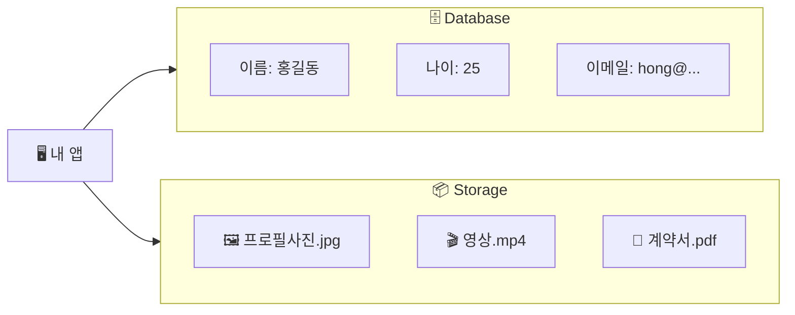

### Database vs Storage

| 구분 | Database | Storage |
|------|----------|---------|
| 저장 대상 | 정형화된 데이터 (텍스트, 숫자) | 비정형화된 파일 (이미지, 영상, 문서) |
| 예시 | 유저 이름, 가격, 날짜 | 프로필 사진, 첨부파일, 동영상 |
| 조회 방법 | SQL 쿼리 | URL 링크 |
| 비유 | 엑셀 표 | 구글 드라이브 |

### Storage에 저장하는 것들

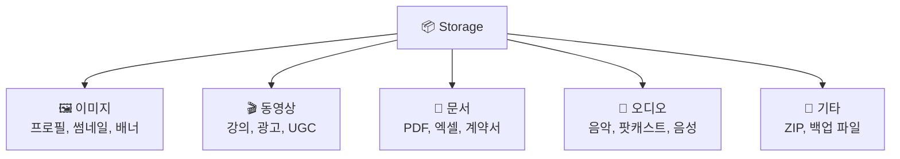

---

### ☁️ Cloudflare R2

**"AWS S3보다 저렴한 클라우드 저장소"**

Cloudflare가 만든 오브젝트 스토리지입니다. AWS S3와 호환되면서 **전송 비용(Egress)이 무료**입니다.

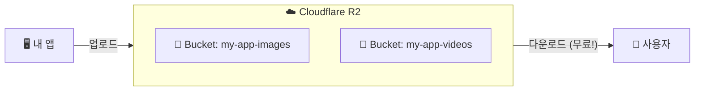

#### R2 핵심 개념

| 용어 | 설명 | 비유 |
|------|------|------|
| **Bucket** | 파일을 담는 최상위 폴더 | 창고 하나 |
| **Object** | 저장된 개별 파일 | 창고 안의 물건 |
| **Key** | 파일의 경로/이름 | 물건의 위치 라벨 |

#### R2 파일 구조 예시

```
my-app-bucket/                    ← Bucket (창고)
├── profiles/                     ← 폴더
│   ├── user_001.jpg             ← Object (파일)
│   └── user_002.jpg
├── posts/
│   ├── post_001/
│   │   ├── thumbnail.jpg
│   │   └── video.mp4
│   └── post_002/
│       └── image.png
└── documents/
    └── terms.pdf
```

#### R2 사용 흐름

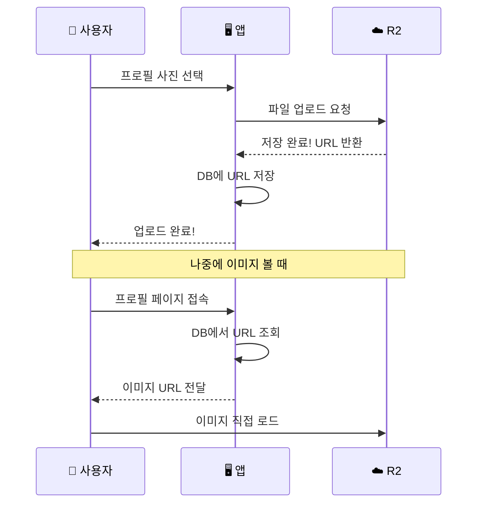

#### Cloudflare R2 설정하기

**1단계: Cloudflare 대시보드 접속**
- [dash.cloudflare.com](https://dash.cloudflare.com) 접속
- 좌측 메뉴에서 **R2 Object Storage** 클릭

**2단계: Bucket 생성**
```
Bucket 이름: my-app-storage
위치: APAC (아시아 태평양) 선택
```

**3단계: API 토큰 생성**
- R2 → Manage R2 API Tokens
- Create API Token 클릭
- 권한: Object Read & Write

**4단계: 앱에서 사용**
```javascript
// 환경변수 설정 필요
R2_ACCESS_KEY_ID=your_access_key
R2_SECRET_ACCESS_KEY=your_secret_key
R2_BUCKET_NAME=my-app-storage
R2_ENDPOINT=https://<account_id>.r2.cloudflarestorage.com
```

---

### 🔥 Firebase Storage

**"Firebase 생태계와 완벽 통합된 저장소"**

Firebase 프로젝트 안에서 파일을 쉽게 저장하고 관리할 수 있습니다.

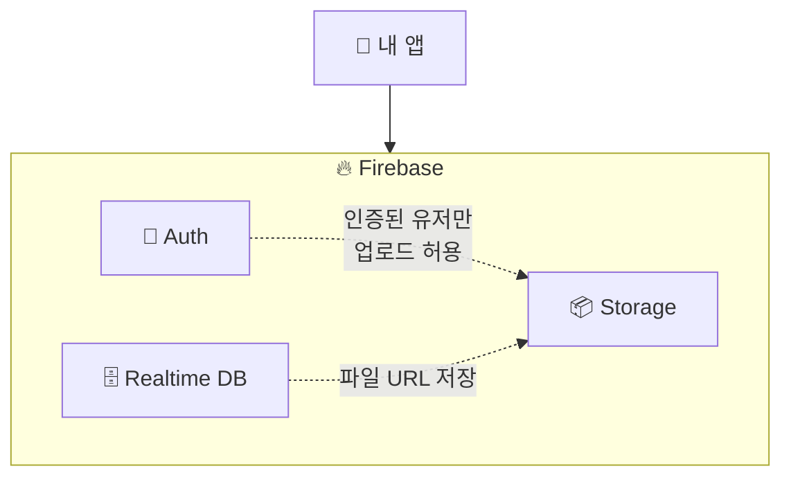

#### Firebase Storage 특징

| 특징 | 설명 |
|------|------|
| **Firebase Auth 연동** | 로그인한 유저만 업로드 가능하게 설정 |
| **보안 규칙** | 누가 어떤 파일에 접근 가능한지 세밀하게 제어 |
| **자동 CDN** | 전 세계 어디서든 빠른 다운로드 |
| **간편한 SDK** | 웹, Android, iOS 모두 쉽게 연동 |

#### Firebase Storage 경로 구조

```
gs://my-app.appspot.com/          ← Storage 루트
├── users/
│   ├── uid_001/
│   │   └── profile.jpg           ← 유저별 프로필
│   └── uid_002/
│       └── profile.jpg
├── posts/
│   └── post_001/
│       ├── image_1.jpg
│       └── image_2.jpg
└── public/
    └── banner.jpg                ← 누구나 접근 가능
```

#### Firebase Storage 보안 규칙 예시

```javascript
rules_version = '2';
service firebase.storage {
  match /b/{bucket}/o {
    // 유저 본인 폴더만 읽기/쓰기 가능
    match /users/{userId}/{allPaths=**} {
      allow read, write: if request.auth != null 
                         && request.auth.uid == userId;
    }
    
    // public 폴더는 누구나 읽기 가능
    match /public/{allPaths=**} {
      allow read: if true;
      allow write: if request.auth != null;
    }
  }
}
```

#### Firebase Storage 사용 예시 (웹)

```javascript
import { getStorage, ref, uploadBytes, getDownloadURL } from "firebase/storage";

// 파일 업로드
const storage = getStorage();
const storageRef = ref(storage, `users/${userId}/profile.jpg`);

await uploadBytes(storageRef, file);  // 파일 업로드
const url = await getDownloadURL(storageRef);  // URL 받기

console.log("다운로드 URL:", url);
// https://firebasestorage.googleapis.com/v0/b/my-app.appspot.com/...
```

---

### Cloudflare R2 vs Firebase Storage

| 항목 | Cloudflare R2 | Firebase Storage |
|------|--------------|-----------------|
| **비용** | 전송(Egress) 무료! | 전송량에 따라 과금 |
| **설정 난이도** | 중간 (API 키 설정) | 쉬움 (Firebase 통합) |
| **인증 연동** | 직접 구현 필요 | Firebase Auth 자동 연동 |
| **CDN** | Cloudflare 글로벌 | Google 글로벌 |
| **추천 상황** | 대용량, 비용 중요 | Firebase 이미 사용 중 |

### 💡 바이브코딩 팁

```
❌ "이미지 업로드 기능 만들어줘"

✅ "프로필 이미지 업로드 기능 만들어줘.
    - Storage: Cloudflare R2 사용
    - Bucket: user-profiles
    - 경로: users/{userId}/profile.jpg
    - 업로드 후 URL을 Supabase users 테이블에 저장해줘"
```

---

## 7. 인증 (Authentication)

### 🎫 비유: 놀이공원 입장

```
인증 = 놀이공원 입구에서 신분증 확인하고 팔찌 받기
인가 = 팔찌 종류에 따라 탈 수 있는 놀이기구가 다름
```

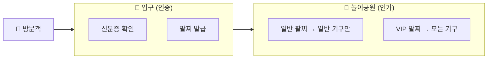

### 인증(Authentication) vs 인가(Authorization)

| 구분 | 인증 (Authentication) | 인가 (Authorization) |
|------|---------------------|---------------------|
| 질문 | "너 누구야?" | "너 이거 해도 돼?" |
| 목적 | 신원 확인 | 권한 확인 |
| 예시 | 로그인 | 관리자만 삭제 가능 |
| 비유 | 신분증 검사 | VIP 팔찌 확인 |

---

### 🔐 인증 흐름 이해하기

#### 기본 로그인 흐름

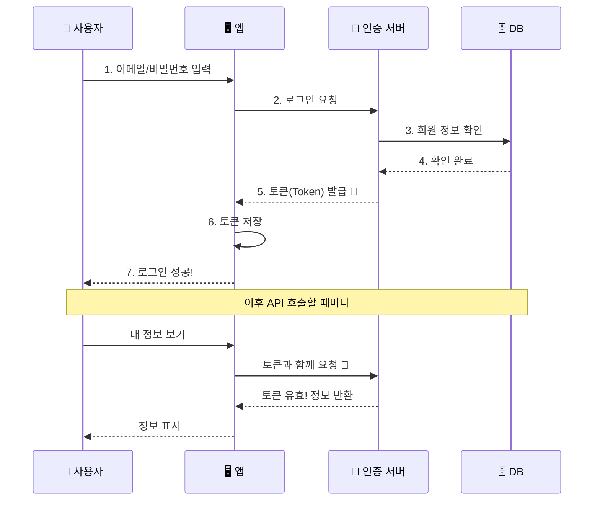

#### 토큰(Token)이란?

```
토큰 = 디지털 신분증 = 놀이공원 팔찌
```

한번 로그인하면 받는 **"통행증"** 입니다. 이후에는 이 토큰만 보여주면 다시 로그인할 필요 없이 서비스를 이용할 수 있습니다.

```javascript
// 토큰 예시 (JWT - JSON Web Token)
eyJhbGciOiJIUzI1NiIsInR5cCI6IkpXVCJ9.
eyJ1c2VySWQiOiJ1c2VyXzAwMSIsImVtYWlsIjoiaG9uZ0BlbWFpbC5jb20ifQ.
abc123signature...

// 이 안에 담긴 정보 (디코딩하면):
{
  "userId": "user_001",
  "email": "hong@email.com",
  "exp": 1699999999  // 만료 시간
}
```

---

### ⚡ Supabase Auth

**PostgreSQL 기반의 강력한 인증 시스템**

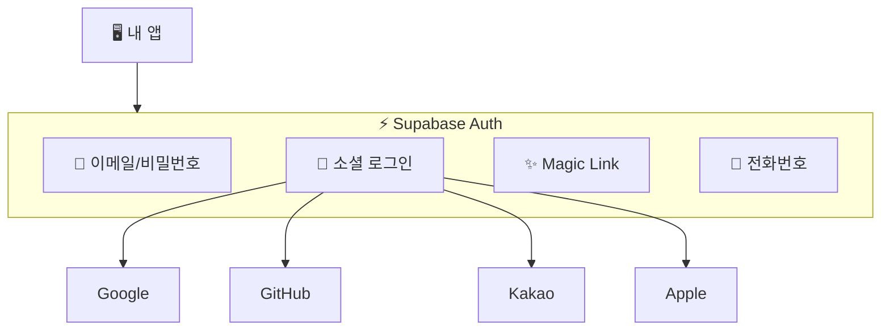

#### Supabase Auth 특징

| 특징 | 설명 |
|------|------|
| **다양한 로그인 방식** | 이메일, 소셜, Magic Link, 전화번호 |
| **Row Level Security** | DB 테이블과 연동해서 권한 제어 |
| **JWT 토큰** | 표준 JWT 사용 |
| **쉬운 설정** | 대시보드에서 클릭 몇 번으로 설정 |

#### Supabase Auth 설정하기

**1단계: 대시보드에서 Provider 활성화**

```
Supabase Dashboard → Authentication → Providers
```

**2단계: 소셜 로그인 설정 (예: Google)**

```
1. Google Cloud Console에서 OAuth 클라이언트 생성
2. Client ID, Client Secret 복사
3. Supabase에 붙여넣기
4. Redirect URL 설정: https://[project].supabase.co/auth/v1/callback
```

#### Supabase Auth 사용 예시

```javascript
import { createClient } from '@supabase/supabase-js'

const supabase = createClient(SUPABASE_URL, SUPABASE_ANON_KEY)

// 📧 이메일 회원가입
const { data, error } = await supabase.auth.signUp({
  email: 'hong@email.com',
  password: 'securepassword123'
})

// 📧 이메일 로그인
const { data, error } = await supabase.auth.signInWithPassword({
  email: 'hong@email.com',
  password: 'securepassword123'
})

// 🔗 Google 로그인
const { data, error } = await supabase.auth.signInWithOAuth({
  provider: 'google'
})

// 👤 현재 로그인한 유저 정보
const { data: { user } } = await supabase.auth.getUser()

// 🚪 로그아웃
await supabase.auth.signOut()
```

#### Row Level Security (RLS) 예시

**"로그인한 유저만 자기 데이터 접근"**

```sql
-- posts 테이블에 RLS 활성화
ALTER TABLE posts ENABLE ROW LEVEL SECURITY;

-- 본인 게시글만 조회 가능
CREATE POLICY "유저는 본인 글만 볼 수 있음" ON posts
  FOR SELECT USING (auth.uid() = user_id);

-- 본인만 게시글 작성 가능
CREATE POLICY "유저는 본인 이름으로만 글 작성" ON posts
  FOR INSERT WITH CHECK (auth.uid() = user_id);
```

---

### 🔥 Firebase Auth

**Google의 강력한 인증 서비스**

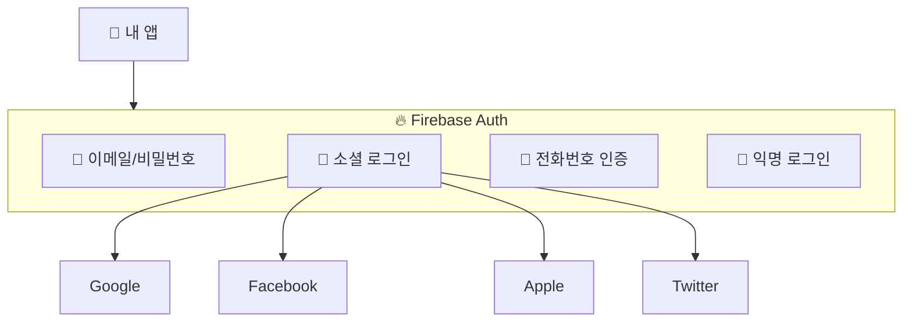

#### Firebase Auth 특징

| 특징 | 설명 |
|------|------|
| **모바일 최적화** | Android, iOS SDK 완벽 지원 |
| **익명 로그인** | 가입 없이 먼저 사용, 나중에 계정 연결 |
| **전화번호 인증** | SMS 인증 기본 제공 |
| **Firebase 통합** | Firestore, Storage와 자동 연동 |

#### Firebase Auth 설정하기

**1단계: Firebase Console에서 활성화**

```
Firebase Console → Authentication → Sign-in method
→ 원하는 로그인 방식 Enable
```

**2단계: 앱에 Firebase SDK 추가**

```javascript
// firebase.js
import { initializeApp } from 'firebase/app';
import { getAuth } from 'firebase/auth';

const firebaseConfig = {
  apiKey: "...",
  authDomain: "my-app.firebaseapp.com",
  projectId: "my-app",
  // ...
};

const app = initializeApp(firebaseConfig);
export const auth = getAuth(app);
```

#### Firebase Auth 사용 예시

```javascript
import { 
  createUserWithEmailAndPassword,
  signInWithEmailAndPassword,
  signInWithPopup,
  GoogleAuthProvider,
  signOut 
} from 'firebase/auth';
import { auth } from './firebase';

// 📧 이메일 회원가입
const userCredential = await createUserWithEmailAndPassword(
  auth, 
  'hong@email.com', 
  'securepassword123'
);
const user = userCredential.user;

// 📧 이메일 로그인
await signInWithEmailAndPassword(auth, 'hong@email.com', 'password');

// 🔗 Google 로그인
const provider = new GoogleAuthProvider();
await signInWithPopup(auth, provider);

// 👤 현재 유저 확인
const currentUser = auth.currentUser;
console.log(currentUser.email);

// 🚪 로그아웃
await signOut(auth);
```

#### Firebase Security Rules 예시

```javascript
rules_version = '2';
service cloud.firestore {
  match /databases/{database}/documents {
    // 로그인한 유저만 자기 데이터 접근
    match /users/{userId} {
      allow read, write: if request.auth != null 
                         && request.auth.uid == userId;
    }
    
    // 게시글은 누구나 읽기, 작성자만 수정/삭제
    match /posts/{postId} {
      allow read: if true;
      allow create: if request.auth != null;
      allow update, delete: if request.auth.uid == resource.data.authorId;
    }
  }
}
```

---

### 인증 흐름 전체 그림

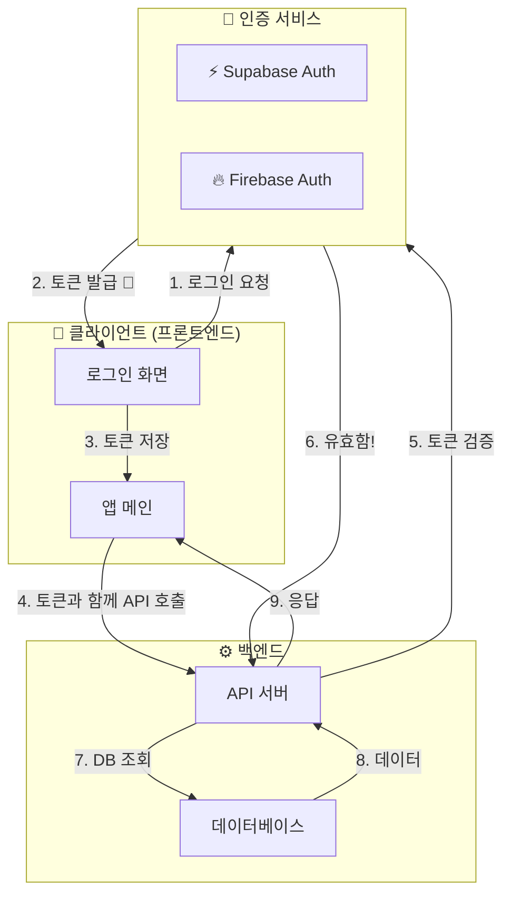

---

### Supabase Auth vs Firebase Auth

| 항목 | Supabase Auth | Firebase Auth |
|------|--------------|---------------|
| **데이터베이스** | PostgreSQL (SQL) | Firestore (NoSQL) |
| **권한 제어** | Row Level Security | Security Rules |
| **소셜 로그인** | ✅ 다양하게 지원 | ✅ 다양하게 지원 |
| **익명 로그인** | ❌ 미지원 | ✅ 지원 |
| **전화번호 인증** | ✅ 지원 | ✅ 지원 (더 쉬움) |
| **MCP 연동** | ✅ 지원 | ❌ 미지원 |
| **추천 상황** | SQL 선호, 웹 중심 | 모바일 앱, Google 생태계 |

### 💡 바이브코딩 팁

```
❌ "로그인 기능 만들어줘"

✅ "Supabase Auth로 로그인 기능 만들어줘.
    - 이메일/비밀번호 로그인
    - Google 소셜 로그인
    - 로그인 후 users 테이블에 프로필 정보 저장
    - 비로그인 유저는 /login으로 리다이렉트
    - RLS로 본인 데이터만 접근 가능하게"
```

---

## 8. 배포 (Deployment)

### 🚀 비유: 음식 배달

```
개발 = 집에서 요리하기
배포 = 요리를 손님에게 배달하기
```

아무리 맛있는 요리를 만들어도, 손님에게 **전달**하지 않으면 의미가 없습니다!

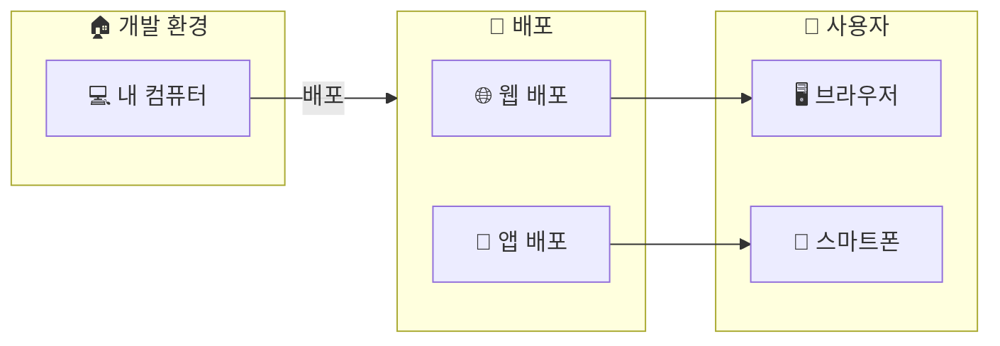

### 배포의 종류

| 플랫폼 | 배포 방식 | 도구 |
|--------|----------|------|
| **웹** | 호스팅 서비스에 업로드 | Vercel, Cloudflare Pages |
| **Android** | Play Store 심사 | Google Play Console |
| **iOS** | App Store 심사 | App Store Connect |

---

### 🌐 웹 배포

#### Vercel

**"Next.js 만든 회사의 배포 서비스"**

Next.js를 만든 회사라서 **Next.js와 궁합이 최고**입니다.

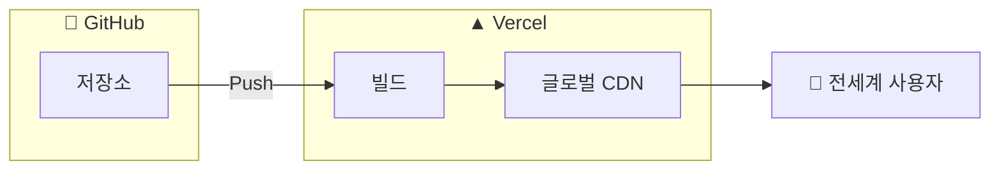

**Vercel 특징:**

| 특징 | 설명 |
|------|------|
| **자동 배포** | GitHub Push하면 자동으로 배포 |
| **Preview 배포** | PR마다 테스트용 URL 생성 |
| **글로벌 CDN** | 전세계 어디서든 빠름 |
| **무료 티어** | 개인 프로젝트 무료 |

**Vercel 배포 방법:**

```bash
# 방법 1: CLI 사용
npm install -g vercel
vercel

# 방법 2: GitHub 연동 (더 쉬움!)
# 1. vercel.com 접속
# 2. GitHub로 로그인
# 3. 저장소 선택
# 4. Deploy 클릭
# 끝!
```

**배포 후 URL 예시:**
```
https://my-app.vercel.app          ← 기본 도메인
https://my-custom-domain.com       ← 커스텀 도메인 연결 가능
```

---

#### Cloudflare Pages

**"빠르고 저렴한 정적 사이트 호스팅"**

Cloudflare의 글로벌 네트워크를 활용한 초고속 배포 서비스입니다.

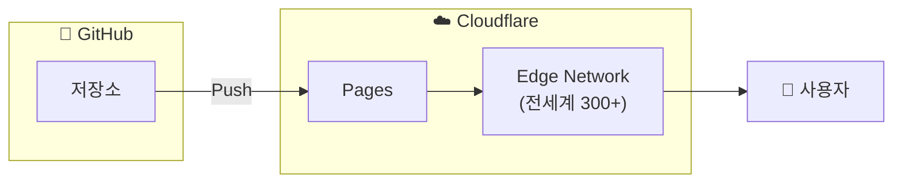

**Cloudflare Pages 특징:**

| 특징 | 설명 |
|------|------|
| **무제한 요청** | 트래픽 걱정 없음 (무료!) |
| **초고속** | 전세계 300+ 데이터센터 |
| **Workers 연동** | 서버리스 함수 연동 가능 |
| **R2 연동** | 스토리지와 쉬운 연동 |

**Cloudflare Pages 배포 방법:**

```bash
# 1. Cloudflare Dashboard → Pages
# 2. Create a project
# 3. Connect to Git → GitHub 선택
# 4. 저장소 선택
# 5. Build settings 설정:

Framework preset: Next.js
Build command: npm run build
Build output directory: .next
```

**환경 변수 설정:**
```
Settings → Environment variables
→ NEXT_PUBLIC_SUPABASE_URL = https://xxx.supabase.co
→ NEXT_PUBLIC_SUPABASE_ANON_KEY = eyJxx...
```

---

#### Vercel vs Cloudflare Pages

| 항목 | Vercel | Cloudflare Pages |
|------|--------|-----------------|
| **Next.js 지원** | ⭐ 최고 (공식) | 좋음 |
| **무료 범위** | 월 100GB 대역폭 | 무제한! |
| **빌드 시간** | 월 6,000분 (무료) | 월 500회 (무료) |
| **서버리스 함수** | Vercel Functions | Workers |
| **추천 상황** | Next.js 프로젝트 | 정적 사이트, 비용 절감 |

### 💡 바이브코딩 팁 (웹 배포)

```
❌ "배포해줘"

✅ "Vercel로 배포 설정해줘.
    - GitHub 저장소: my-app
    - 환경변수: NEXT_PUBLIC_SUPABASE_URL, NEXT_PUBLIC_SUPABASE_ANON_KEY
    - 커스텀 도메인: myapp.com 연결
    - main 브랜치 push하면 자동 배포되게"
```

---

### 📱 모바일 앱 배포

#### 모바일 배포 전체 흐름

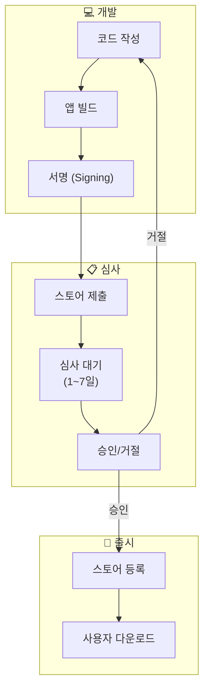

---

#### 🤖 Google Play Store (Android)

**Play Console에서 앱을 등록하고 관리합니다.**

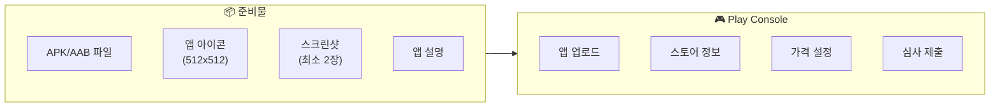

**Android 배포 준비물:**

| 항목 | 설명 | 규격 |
|------|------|------|
| **APK/AAB** | 앱 설치 파일 | AAB 권장 (2021년부터 필수) |
| **앱 아이콘** | 스토어에 표시되는 아이콘 | 512 x 512 PNG |
| **스크린샷** | 앱 미리보기 | 최소 2장, 폰/태블릿별 |
| **피처 그래픽** | 스토어 배너 이미지 | 1024 x 500 |
| **앱 설명** | 앱 소개 텍스트 | 최대 4,000자 |
| **개인정보처리방침** | 필수 (URL) | 웹페이지 링크 |

**Android 배포 절차:**

```
1. Google Play Console 가입 (등록비 $25, 1회)
   → play.google.com/console

2. 앱 만들기
   → 앱 이름, 기본 언어, 앱/게임 여부 선택

3. 앱 서명 키 설정
   → Google이 관리하는 서명 권장

4. 스토어 등록 정보 입력
   → 아이콘, 스크린샷, 설명 등

5. 콘텐츠 등급 설문
   → 폭력성, 성인 콘텐츠 여부 답변

6. 가격 및 배포 국가 설정

7. AAB 파일 업로드
   → 내부 테스트 → 비공개 테스트 → 프로덕션

8. 심사 제출
   → 보통 1~3일 소요 (첫 앱은 7일까지)
```

**테스트 트랙 종류:**

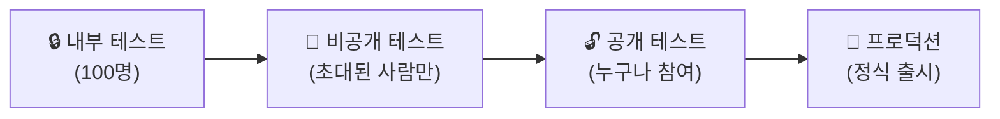

---

#### 🍎 App Store (iOS)

**App Store Connect에서 앱을 등록하고 관리합니다.**

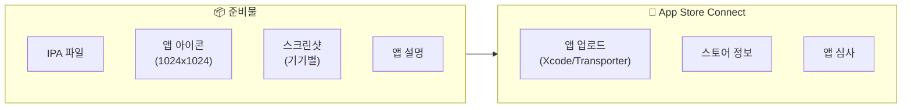

**iOS 배포 준비물:**

| 항목 | 설명 | 규격 |
|------|------|------|
| **IPA** | 앱 설치 파일 | Xcode로 Archive |
| **앱 아이콘** | 스토어 아이콘 | 1024 x 1024 PNG |
| **스크린샷** | 기기별 필요 | iPhone 6.9", 6.5", iPad 등 |
| **앱 설명** | 앱 소개 | 최대 4,000자 |
| **개인정보처리방침** | 필수 | URL 링크 |
| **앱 미리보기** | 동영상 (선택) | 15~30초 |

**iOS 배포 절차:**

```
1. Apple Developer 가입 (연 $99 = 약 13만원)
   → developer.apple.com

2. App Store Connect에서 앱 등록
   → appstoreconnect.apple.com

3. 인증서 & 프로비저닝 프로파일 설정
   → Xcode에서 자동 관리 가능

4. Xcode에서 Archive 생성
   → Product → Archive

5. App Store Connect에 업로드
   → Xcode → Distribute App → App Store Connect

6. 스토어 정보 입력
   → 스크린샷, 설명, 카테고리 등

7. 앱 심사 제출
   → 보통 24~48시간 (거절되면 더 오래)

8. 승인 후 출시
   → 즉시 출시 or 예약 출시 선택
```

**iOS 심사 주요 거절 사유:**

| 거절 사유 | 설명 |
|----------|------|
| **버그/크래시** | 앱이 죽거나 기능이 안 됨 |
| **불완전한 정보** | 스크린샷, 설명 부족 |
| **가이드라인 위반** | 결제 정책, 콘텐츠 규정 |
| **개인정보** | 개인정보 수집 고지 누락 |
| **메타데이터** | 앱 이름, 설명의 오해 소지 |

**TestFlight (iOS 베타 테스트):**

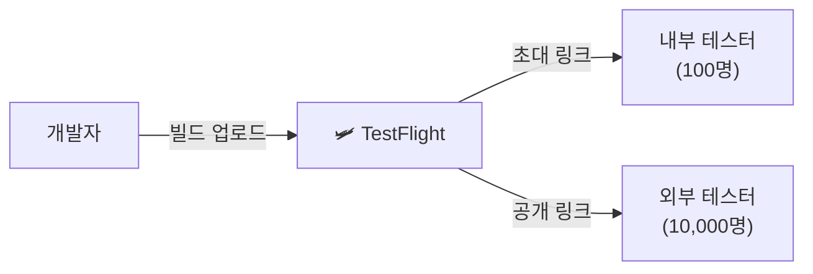

---

### 모바일 배포 비교

| 항목 | Google Play Store | App Store |
|------|------------------|-----------|
| **등록 비용** | $25 (1회) | $99/년 |
| **심사 기간** | 1~7일 | 24~48시간 |
| **심사 엄격도** | 상대적 느슨 | 매우 엄격 |
| **업데이트 심사** | 빠름 | 동일하게 심사 |
| **테스트 배포** | 내부/비공개/공개 | TestFlight |
| **결제 수수료** | 15~30% | 15~30% |

---

### 배포 전 체크리스트

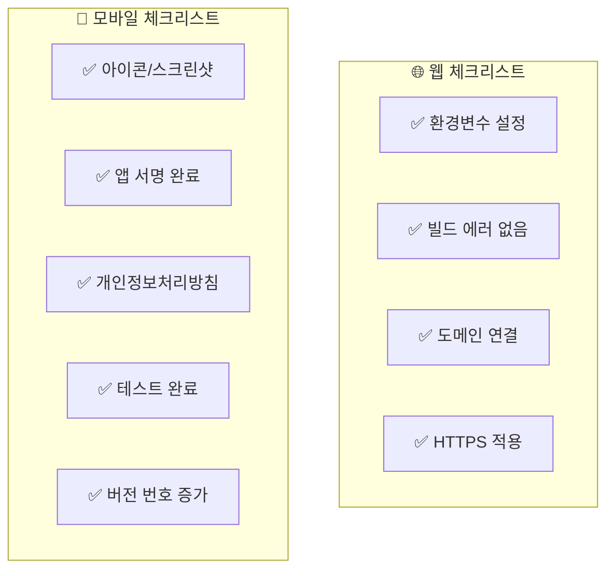

### 💡 바이브코딩 팁 (모바일 배포)

```
❌ "앱스토어 올려줘"

✅ "iOS 앱스토어 배포 준비해줘.
    - 앱 이름: My App
    - 번들 ID: com.mycompany.myapp
    - 버전: 1.0.0
    - 카테고리: 생산성
    - Xcode에서 Archive 하는 방법이랑
    - App Store Connect 설정 방법 알려줘"
```

---

## 📝 Part 2 정리: 바이브코딩 체크리스트

| 개념 | 지시할 때 명시하면 좋은 것 |
|------|-------------------------|
| **Storage** | "R2/Firebase Storage 사용", "버킷 이름", "폴더 구조" |
| **인증** | "Supabase/Firebase Auth", "소셜 로그인 종류", "권한 규칙" |
| **웹 배포** | "Vercel/Cloudflare Pages", "환경변수", "도메인" |
| **앱 배포** | "스토어 종류", "버전", "테스트 트랙" |

---

## 🎯 전체 아키텍처 한눈에 보기

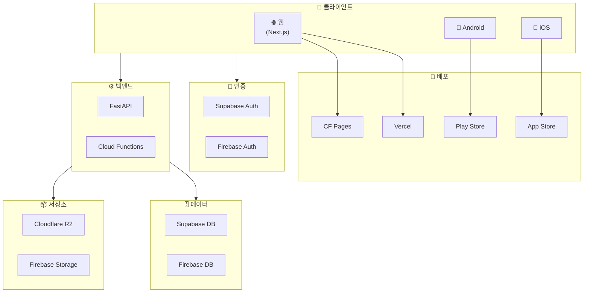

---

## 📚 추천 조합

| 용도 | 추천 스택 |
|------|----------|
| **웹 서비스 (빠른 개발)** | Next.js + Supabase + Vercel |
| **웹 서비스 (비용 절감)** | Next.js + Supabase + Cloudflare Pages + R2 |
| **모바일 앱 (실시간)** | Flutter + Firebase 전체 |
| **풀스택 (바이브코딩)** | Next.js + Supabase (MCP) + Vercel |

---

> 📌 **이 문서는 GitHub에서 관리됩니다.**  
> 피드백이나 추가 요청은 Issue로 남겨주세요!
> 
> **Part 1 보러가기:** [프론트엔드/백엔드, API, 에러, 프레임워크, 데이터베이스](./vibe-coding-guide-for-non-developers.md)
