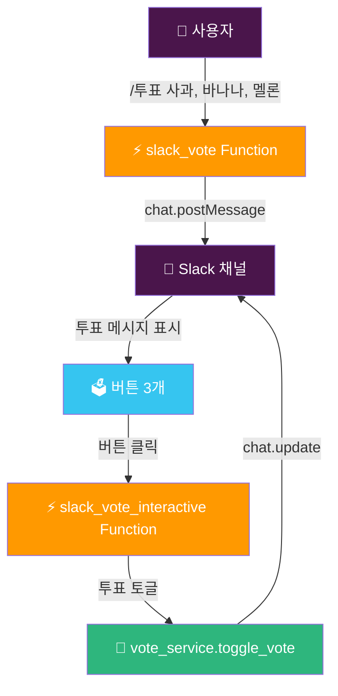
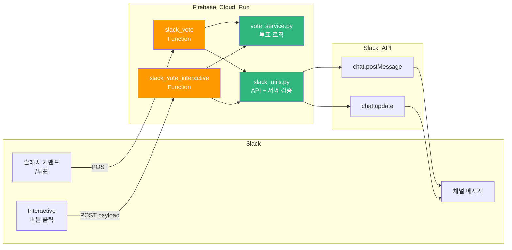

# 🗳️ Slack 투표 봇 - 슬래시 커맨드로 간편하게 투표를

<div align="center">

[](https://firebase.google.com/docs/functions)
[](https://www.python.org/)
[](https://api.slack.com/)
[](https://cloud.google.com/run)

**슬랙 채널에서 `/투표` 한 줄로 투표를 만들고, 버튼 클릭으로 참여하세요** ✨

[🎯 주요 기능](#-프로젝트-소개) | [🚀 배포하기](#-배포-가이드) | [⚙️ Slack 앱 설정](#️-slack-앱-설정-가이드) | [🐛 트러블슈팅](#-트러블슈팅)

> 🇺🇸 [English README](./README_EN.md)

</div>

---

## 🎯 프로젝트 소개

팀에서 점심 메뉴, 회의 일정, 의사결정을 투표로 빠르게 정리하고 싶을 때 사용하는 Slack 봇입니다.
Firebase Cloud Functions(2세대, Cloud Run 기반)로 서버리스 배포되어 관리 부담이 없습니다.

### ✨ 주요 기능

- 🗳️ **간편 투표 생성** — `/투표 옵션1, 옵션2, 옵션3` 한 줄로 투표 생성
- 👆 **다중 선택** — 여러 항목에 동시에 투표 가능
- 🔁 **토글 투표** — 같은 버튼 다시 클릭하면 투표 취소
- 👥 **투표자 표시** — 누가 투표했는지 @mention으로 실시간 표시
- 🌐 **영문 지원** — `/vote option1, option2, option3` 영어 커맨드 지원
- 💾 **데이터 영속성** — 별도 DB 없이 메시지 자체에 투표 데이터 저장

---

## 🎮 사용 방법

### 📝 단계별 가이드

```
/투표 옵션1, 옵션2, 옵션3
```

예시:
```
/투표 짜장면, 짬뽕, 탕수육
/투표 월요일, 화요일, 수요일
/vote apple, banana, melon
```



---

## 🏗️ 기술 스택

<div align="center">

| 카테고리 | 기술 | 용도 |
|----------|------|------|
| Runtime | Python 3.13 | 함수 실행 환경 |
| Serverless | Firebase Functions (2세대) | Cloud Run 기반 HTTP 함수 |
| Slack | slack-sdk 3.x | API 호출 및 서명 검증 |
| Secrets | Firebase Secret Manager | SLACK_BOT_TOKEN, SLACK_SIGNING_SECRET 보관 |
| Region | asia-northeast3 (서울) | 레이턴시 최소화 |

</div>

### 🎨 아키텍처



> **핵심 설계:** 투표 데이터는 별도 DB 없이 각 버튼의 `value` 필드(JSON)에 저장됩니다.
> 봇이 `chat.postMessage`로 직접 메시지를 올려야 나중에 `chat.update`로 수정 가능합니다.

---

## 📁 프로젝트 구조

```
vote/
├── 📂 functions/
│   ├── 🐍 main.py              # Firebase Functions 진입점 (2개 함수)
│   ├── 🗳️ vote_service.py      # 투표 로직 및 Block Kit UI 생성
│   ├── 🔧 slack_utils.py       # Slack API 호출 + HMAC 서명 검증
│   └── 📦 requirements.txt     # Python 의존성
├── ⚙️ firebase.json             # Firebase 배포 설정
├── 🔗 .firebaserc               # Firebase 프로젝트 연결
├── 🚫 .gitignore                # venv, pycache 등 제외
└── 📖 README.md                 # 이 파일
```

---

## 🚀 배포 가이드

### 📋 사전 준비물

- Firebase CLI (`npm install -g firebase-tools` — 아래 설치 주의사항 참고)
- Firebase 프로젝트 생성 완료
- Python 3.12 이상
- Slack 앱 생성 완료 (아래 Slack 앱 설정 가이드 참고)

### 🔧 Firebase CLI 설치 (Apple Silicon Mac 주의)

> ⚠️ **Apple Silicon(M1/M2/M3) Mac 사용자는 반드시 nvm을 통해 설치하세요.**
> `/usr/local/bin/firebase` standalone 바이너리는 x86_64 전용이라 arm64 환경에서 아키텍처 충돌이 발생합니다.

```bash
# nvm이 설치되어 있다면
source ~/.nvm/nvm.sh
npm install -g firebase-tools

# 설치 확인 (nvm firebase가 우선 사용되는지 확인)
which firebase
# → /Users/{user}/.nvm/versions/node/vXX.X.X/bin/firebase  ✅
# → /usr/local/bin/firebase  ❌ (x86_64 standalone 바이너리)
```

### 🔧 가상환경 설정

```bash
cd slack-commands/vote/functions
python3 -m venv venv
source venv/bin/activate
pip install -r requirements.txt
```

### 🚀 배포 방법

```bash
# Firebase 로그인
firebase login

# 프로젝트 연결 (.firebaserc 설정)
firebase use --add
# → 프로젝트 선택 후 alias에 "default" 입력

# Slack Secrets 등록 (최초 1회)
firebase functions:secrets:set SLACK_SIGNING_SECRET
firebase functions:secrets:set SLACK_BOT_TOKEN

# 배포
source ~/.nvm/nvm.sh  # Apple Silicon Mac
firebase deploy --only functions
```

배포 완료 후 Cloud Run URL 확인:
```
✔ slack_vote: https://slack-vote-{hash}-du.a.run.app
✔ slack_vote_interactive: https://slack-vote-interactive-{hash}-du.a.run.app
```

> ℹ️ Firebase Functions 2세대는 Cloud Run 기반으로 배포되어 URL 형식이
> `asia-northeast3-{project}.cloudfunctions.net` 대신 `{name}-{hash}-du.a.run.app` 형태입니다.

### ⚙️ 사용 가능한 명령어

| 명령어 | 설명 |
|--------|------|
| `firebase deploy --only functions` | Functions 배포 |
| `firebase functions:log --only slack_vote` | slack_vote 로그 확인 |
| `firebase functions:log --only slack_vote_interactive` | interactive 로그 확인 |
| `firebase functions:secrets:set {KEY}` | Secret 등록/수정 |

---

## ⚙️ Slack 앱 설정 가이드

### Manifest로 앱 생성 (권장)

[https://api.slack.com/apps](https://api.slack.com/apps) → **Create New App** → **From a manifest** 선택 후 아래 YAML 사용 (`{CLOUD_RUN_HASH}` 교체):

```yaml
display_information:
  name: 투표봇
  description: 슬랙 채널에서 투표를 만들고 참여하는 봇
  background_color: "#2c2d30"

features:
  slash_commands:
    - command: /투표
      url: https://slack-vote-{CLOUD_RUN_HASH}-du.a.run.app
      description: 투표를 생성합니다
      usage_hint: "옵션1, 옵션2, 옵션3"
      should_escape: false
    - command: /vote
      url: https://slack-vote-{CLOUD_RUN_HASH}-du.a.run.app
      description: Create a vote
      usage_hint: "option1, option2, option3"
      should_escape: false
  bot_user:
    display_name: 투표봇
    always_online: false

oauth_config:
  scopes:
    bot:
      - chat:write
      - commands

settings:
  interactivity:
    is_enabled: true
    request_url: https://slack-vote-interactive-{CLOUD_RUN_HASH}-du.a.run.app
  org_deploy_enabled: false
  socket_mode_enabled: false
  token_rotation_enabled: false
```

### 토큰 수집

앱 생성 후:
1. **Settings > Install App** → **Install to Workspace** → `xoxb-...` 토큰 복사
2. **Settings > Basic Information > App Credentials** → **Signing Secret** 복사

---

## 🧪 테스트 가이드

### 기본 기능 테스트

| 테스트 | 입력 | 예상 결과 |
|--------|------|-----------|
| 투표 생성 | `/투표 사과, 바나나, 멜론` | 버튼 3개 메시지 표시 |
| 투표하기 | 사과 버튼 클릭 | "사과 (1)" + @나 표시 |
| 투표 취소 | 사과 버튼 재클릭 | "사과 (0)" + 이름 삭제 |
| 복수 투표 | 사과 + 바나나 클릭 | 두 항목 모두 @나 표시 |

### 에러 케이스 테스트

| 테스트 | 입력 | 예상 결과 |
|--------|------|-----------|
| 옵션 없음 | `/투표` | "사용법: /투표 옵션1, 옵션2, 옵션3" |
| 옵션 1개 | `/투표 사과` | "최소 2개 이상의 옵션이 필요합니다" |
| 옵션 11개+ | `/투표 1,2,3,4,5,6,7,8,9,10,11` | "최대 10개까지 옵션을 입력할 수 있습니다" |

---

## 🐛 트러블슈팅

### ❌ venv 없음 오류

```
Error: Failed to find location of Firebase Functions SDK: Missing virtual environment at venv directory.
Did you forget to run 'python3.13 -m venv venv'?
```

**해결:**
```bash
cd functions
python3 -m venv venv
source venv/bin/activate
pip install -r requirements.txt
```

---

### ❌ 아키텍처 불일치 오류 (Apple Silicon)

```
ImportError: dlopen(..._cffi_backend.cpython-313-darwin.so...)
(mach-o file, but is an incompatible architecture (have 'arm64', need 'x86_64'))
```

**원인:** `/usr/local/bin/firebase` standalone 바이너리가 x86_64(Rosetta)로 실행되어 arm64 Python 패키지와 충돌.

**해결:** nvm을 통해 arm64 node 기반 Firebase CLI 설치:
```bash
source ~/.nvm/nvm.sh
npm install -g firebase-tools
# 이후 항상 nvm firebase 사용 확인: which firebase
```

---

### ❌ 401 Invalid Signature

**원인:** Firebase에 등록된 `SLACK_SIGNING_SECRET`이 Slack 앱의 실제 값과 불일치.

**해결:** Slack 앱 > **Basic Information > App Credentials > Signing Secret** 에서 값을 복사 후 재등록:
```bash
firebase functions:secrets:set SLACK_SIGNING_SECRET
firebase deploy --only functions
```

---

### ❌ cant_update_message (버튼 클릭 시 업데이트 안 됨)

```
Slack API 에러: cant_update_message
```

**원인:** 슬래시 커맨드 응답(`response_type: in_channel`)으로 올린 메시지는 봇 소유가 아니어서 `chat.update` 불가.

**해결:** `slack_vote` 함수에서 `chat.postMessage`로 봇이 직접 메시지를 올려야 합니다. (이 레포의 코드는 이미 수정되어 있음)

---

### ❌ firebase use --add 프로젝트 alias

```
? What alias do you want to use for this project? (e.g. staging)
```

**→ `default` 입력** (이후 firebase 명령어에서 자동으로 사용됨)

---

### ❌ 컨테이너 이미지 보관 기간 질문

```
How many days do you want to keep container images before they're deleted?
```

**→ `1` 입력** (테스트/개인 프로젝트는 1일로 충분)

---

## 📌 제한 사항

- 최대 **10개** 옵션
- 옵션당 최대 **약 150명** 투표 (Slack 버튼 value 2000자 제한)
- 메시지 삭제 시 투표 데이터 소멸 (별도 DB 미사용)
- 옵션 텍스트 최대 **50자**

---

## 🤝 기여하기

1. Fork the repository
2. Create your feature branch (`git checkout -b feature/AmazingFeature`)
3. Commit your changes (`git commit -m 'Add some AmazingFeature'`)
4. Push to the branch (`git push origin feature/AmazingFeature`)
5. Open a Pull Request

---

## 📄 라이선스

Internal Use Only

---

## 👨‍💻 만든 사람

**izowooi**

문제가 있으시면 [Issue](https://github.com/izowooi/clever-chip/issues)를 등록해주세요.

---

<div align="center">

**⭐ 이 프로젝트가 마음에 드셨다면 Star를 눌러주세요! ⭐**

Made with ❤️ using Firebase Functions + Slack API

</div>
