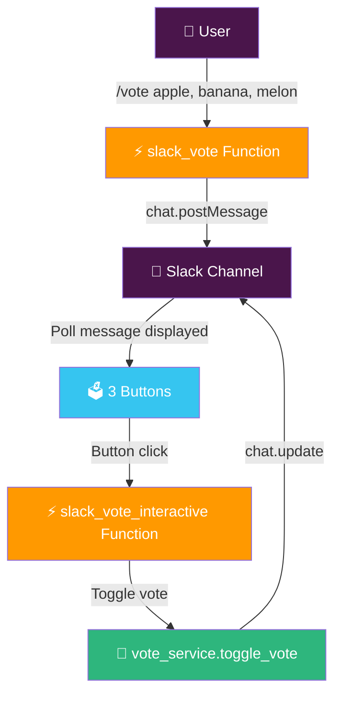
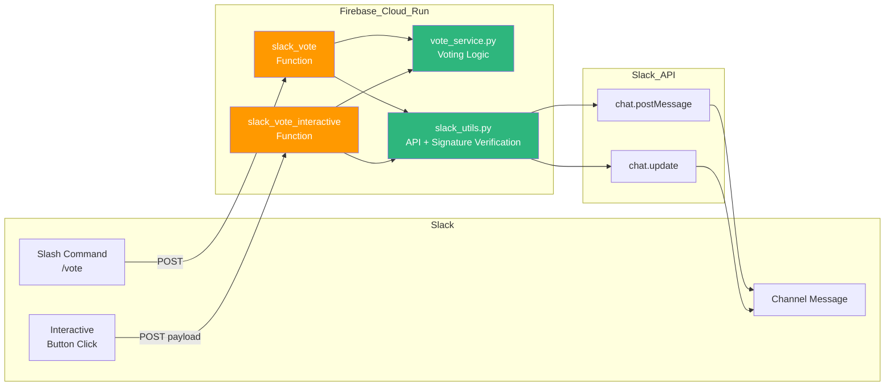

# 🗳️ Slack Vote Bot - Create polls with a simple slash command

<div align="center">

[](https://firebase.google.com/docs/functions)
[](https://www.python.org/)
[](https://api.slack.com/)
[](https://cloud.google.com/run)

**Create a poll in your Slack channel with a single `/vote` command and participate with button clicks** ✨

[🎯 Features](#-project-overview) | [🚀 Deploy](#-deployment-guide) | [⚙️ Slack App Setup](#️-slack-app-setup-guide) | [🐛 Troubleshooting](#-troubleshooting)

> 🇰🇷 [한국어 README](./README.md)

</div>

---

## 🎯 Project Overview

A Slack bot for quickly settling team decisions — lunch menus, meeting schedules, votes — right inside Slack.
Deployed serverlessly on Firebase Cloud Functions (2nd Gen, Cloud Run-based) with zero infrastructure management.

### ✨ Key Features

- 🗳️ **Easy poll creation** — Create a poll with `/vote option1, option2, option3`
- 👆 **Multi-select** — Vote for multiple options simultaneously
- 🔁 **Toggle voting** — Click the same button again to cancel your vote
- 👥 **Voter display** — See who voted via @mention in real time
- 🌐 **Korean support** — `/투표 옵션1, 옵션2, 옵션3` Korean command supported
- 💾 **Data persistence** — Vote data stored in the message itself, no external DB needed

---

## 🎮 How to Use

### 📝 Step-by-step Guide

```
/vote option1, option2, option3
```

Examples:
```
/vote pizza, pasta, salad
/vote Monday, Tuesday, Wednesday
/투표 사과, 바나나, 멜론
```



---

## 🏗️ Tech Stack

<div align="center">

| Category | Technology | Purpose |
|----------|-----------|---------|
| Runtime | Python 3.13 | Function execution environment |
| Serverless | Firebase Functions (2nd Gen) | Cloud Run-based HTTP functions |
| Slack | slack-sdk 3.x | API calls and signature verification |
| Secrets | Firebase Secret Manager | Stores SLACK_BOT_TOKEN, SLACK_SIGNING_SECRET |
| Region | asia-northeast3 (Seoul) | Minimize latency |

</div>

### 🎨 Architecture



> **Key design decision:** Vote data is stored in each button's `value` field (JSON) — no external DB needed.
> The bot must post messages via `chat.postMessage` to own them and later update them with `chat.update`.

---

## 📁 Project Structure

```
vote/
├── 📂 functions/
│   ├── 🐍 main.py              # Firebase Functions entry point (2 functions)
│   ├── 🗳️ vote_service.py      # Voting logic and Block Kit UI construction
│   ├── 🔧 slack_utils.py       # Slack API calls + HMAC signature verification
│   └── 📦 requirements.txt     # Python dependencies
├── ⚙️ firebase.json             # Firebase deployment config
├── 🔗 .firebaserc               # Firebase project link
├── 🚫 .gitignore                # Excludes venv, pycache, etc.
└── 📖 README.md                 # Korean README
```

---

## 🚀 Deployment Guide

### 📋 Prerequisites

- Firebase CLI (see installation note below)
- Firebase project created
- Python 3.12+
- Slack app created (see Slack App Setup Guide)

### 🔧 Firebase CLI Installation (Apple Silicon Mac Warning)

> ⚠️ **Apple Silicon (M1/M2/M3) Mac users must install via nvm.**
> The `/usr/local/bin/firebase` standalone binary is x86_64-only and causes architecture conflicts on arm64.

```bash
# If nvm is installed
source ~/.nvm/nvm.sh
npm install -g firebase-tools

# Verify the correct firebase is used
which firebase
# → /Users/{user}/.nvm/versions/node/vXX.X.X/bin/firebase  ✅
# → /usr/local/bin/firebase  ❌ (x86_64 standalone binary)
```

### 🔧 Virtual Environment Setup

```bash
cd slack-commands/vote/functions
python3 -m venv venv
source venv/bin/activate
pip install -r requirements.txt
```

### 🚀 Deploy

```bash
# Firebase login
firebase login

# Link Firebase project
firebase use --add
# → Select project, type "default" as alias

# Register Slack Secrets (first time only)
firebase functions:secrets:set SLACK_SIGNING_SECRET
firebase functions:secrets:set SLACK_BOT_TOKEN

# Deploy
source ~/.nvm/nvm.sh  # Apple Silicon Mac
firebase deploy --only functions
```

After deployment, confirm the Cloud Run URLs:
```
✔ slack_vote: https://slack-vote-{hash}-du.a.run.app
✔ slack_vote_interactive: https://slack-vote-interactive-{hash}-du.a.run.app
```

> ℹ️ Firebase Functions 2nd Gen is Cloud Run-based, so URLs follow the
> `{name}-{hash}-du.a.run.app` format instead of `asia-northeast3-{project}.cloudfunctions.net`.

### ⚙️ Available Commands

| Command | Description |
|---------|-------------|
| `firebase deploy --only functions` | Deploy functions |
| `firebase functions:log --only slack_vote` | View slack_vote logs |
| `firebase functions:log --only slack_vote_interactive` | View interactive logs |
| `firebase functions:secrets:set {KEY}` | Add/update a secret |

---

## ⚙️ Slack App Setup Guide

### Create App via Manifest (Recommended)

Go to [https://api.slack.com/apps](https://api.slack.com/apps) → **Create New App** → **From a manifest**, then paste the YAML below (replace `{CLOUD_RUN_HASH}`):

```yaml
display_information:
  name: VoteBot
  description: Create and participate in polls in Slack channels
  background_color: "#2c2d30"

features:
  slash_commands:
    - command: /vote
      url: https://slack-vote-{CLOUD_RUN_HASH}-du.a.run.app
      description: Create a vote
      usage_hint: "option1, option2, option3"
      should_escape: false
    - command: /투표
      url: https://slack-vote-{CLOUD_RUN_HASH}-du.a.run.app
      description: 투표를 생성합니다
      usage_hint: "옵션1, 옵션2, 옵션3"
      should_escape: false
  bot_user:
    display_name: VoteBot
    always_online: false

oauth_config:
  scopes:
    bot:
      - chat:write
      - commands

settings:
  interactivity:
    is_enabled: true
    request_url: https://slack-vote-interactive-{CLOUD_RUN_HASH}-du.a.run.app
  org_deploy_enabled: false
  socket_mode_enabled: false
  token_rotation_enabled: false
```

### Collect Tokens

After creating the app:
1. **Settings > Install App** → **Install to Workspace** → Copy the `xoxb-...` token
2. **Settings > Basic Information > App Credentials** → Copy the **Signing Secret**

---

## 🧪 Testing Guide

### Basic Function Tests

| Test | Input | Expected Result |
|------|-------|----------------|
| Create poll | `/vote apple, banana, melon` | Message with 3 buttons |
| Vote | Click apple button | "apple (1)" + @you displayed |
| Cancel vote | Click apple button again | "apple (0)" + name removed |
| Multi-vote | Click apple + banana | Both show @you |

### Error Case Tests

| Test | Input | Expected Result |
|------|-------|----------------|
| No options | `/vote` | "Usage: /vote option1, option2, option3" |
| 1 option | `/vote apple` | "At least 2 options required" |
| 11+ options | `/vote 1,2,3,4,5,6,7,8,9,10,11` | "Maximum 10 options allowed" |

---

## 🐛 Troubleshooting

### ❌ Missing venv error

```
Error: Failed to find location of Firebase Functions SDK: Missing virtual environment at venv directory.
Did you forget to run 'python3.13 -m venv venv'?
```

**Fix:**
```bash
cd functions
python3 -m venv venv
source venv/bin/activate
pip install -r requirements.txt
```

---

### ❌ Architecture mismatch error (Apple Silicon)

```
ImportError: dlopen(..._cffi_backend.cpython-313-darwin.so...)
(mach-o file, but is an incompatible architecture (have 'arm64', need 'x86_64'))
```

**Cause:** The `/usr/local/bin/firebase` standalone binary runs as x86_64 (via Rosetta) and conflicts with arm64 Python packages.

**Fix:** Install Firebase CLI via nvm with arm64 node:
```bash
source ~/.nvm/nvm.sh
npm install -g firebase-tools
# Confirm: which firebase should point to .nvm path
```

---

### ❌ 401 Invalid Signature

**Cause:** The `SLACK_SIGNING_SECRET` registered in Firebase doesn't match the actual Slack app value.

**Fix:** Copy the correct value from Slack app > **Basic Information > App Credentials > Signing Secret** and re-register:
```bash
firebase functions:secrets:set SLACK_SIGNING_SECRET
firebase deploy --only functions
```

---

### ❌ cant_update_message (buttons not updating)

```
Slack API error: cant_update_message
```

**Cause:** Messages posted as slash command responses (`response_type: in_channel`) are not owned by the bot, so `chat.update` is rejected.

**Fix:** The `slack_vote` function must use `chat.postMessage` to post the message directly as the bot. (Already fixed in this repo.)

---

### ❌ Project alias prompt during `firebase use --add`

```
? What alias do you want to use for this project? (e.g. staging)
```

**→ Type `default`** (automatically used for all subsequent firebase commands)

---

### ❌ Container image retention question

```
How many days do you want to keep container images before they're deleted?
```

**→ Type `1`** (1 day is sufficient for test/personal projects)

---

## 📌 Limitations

- Maximum **10** options per poll
- Maximum **~150 voters** per option (Slack button value field is limited to 2000 chars)
- Vote data is lost if the message is deleted (no external DB)
- Option text maximum **50 characters**

---

## 🤝 Contributing

1. Fork the repository
2. Create your feature branch (`git checkout -b feature/AmazingFeature`)
3. Commit your changes (`git commit -m 'Add some AmazingFeature'`)
4. Push to the branch (`git push origin feature/AmazingFeature`)
5. Open a Pull Request

---

## 📄 License

Internal Use Only

---

## 👨‍💻 Author

**izowooi**

If you find any issues, please open an [Issue](https://github.com/izowooi/clever-chip/issues).

---

<div align="center">

**⭐ If you find this project useful, please give it a Star! ⭐**

Made with ❤️ using Firebase Functions + Slack API

</div>
